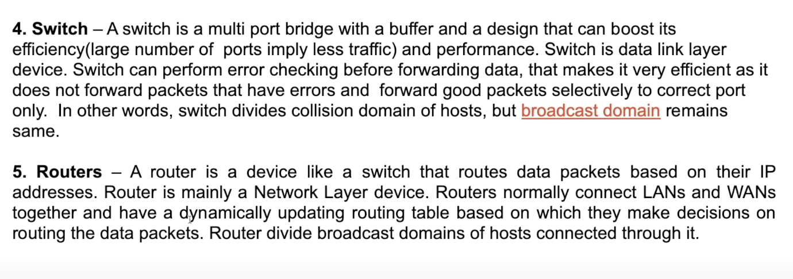

1. Network => Computers connected over a network. Internet => Collection of these computer networks
2. The Internet Society sets the rules of how the internet works across the globe. Protocols -> Rules set up the internet society
3. Client - Server model.
                Request
Client -------------------------->Server
       <-------------------------
                Response

4. Protocols:-
    a) TCP => Transmission Control Protocol => It makes sure that the data reaches the destination and doesn't get corrupted on the way.
                Ex:- Sending an email.
    b) UDP => User Datagram Protocol => It's ok if the entire data is not reaching the end user. Ex:- Video calls.
    c) HTTP => Hyper Text Transfer Protocol => Used by web browsers which describes the format in which data is being transferred between clients and servers.

5. Every other device that is connected to each other over a network has something called as "IP Address". 
    To check IP address of the device run => $ curl ifconfig.me -s
    ISP ==> Modem/Router [This will have a Global IP Address, all devices connected to this will have same IP address] ==> Router is connected to 4 Devices D1, D2, D3, D4. The Modem gives IP Addresses to these 4 devices called as "Local IP Addresses", this is done by DHCP{Dynamic Host Configuration Protocol}.
    Now say if any of the device makes a request to google.com, it's the Global IP Address of the modem that sends the request, when the response comes back from google to the router, it decides which of the connected devices had made the request using the local IP addresses assigned by it to the devices by a process called NAT[Network Access Translator]. Tier1 ISP => Tata; Tier2 ISP => Airtel, Jio

6. Now Modem understands which device to send the data using IP Address of the device but which application to send the data in the particular device is found by using the port number. All HTTP requests happen via port 80, MongoDB via 27017.
Ports 0 - 1023 => Reserved Ports, 1024-49152 => Reserved for some specific applications. The remaining ones we can use.

7. 1mbps download speed => You are downloading 10^6 bits per second from some other computer to your computer and vice versa for the upload speed.
    a) Guided Way => Communication is happening with a definite path => connected using a wire
    b) Unguided Way => Communication is happening without any guided path => Connected using wifi, bluetooth. 
        Physically the entire network is connected with optical fibre cables underwater. [speed using optical fibres >>> sattelites ]
        Wireless network includes radio channels, bluetooth's(for short range), wifi(for short range), 3G/4G/5G Volte(For Longer Ranges)

8. LAN => Local Area Network => Connecting a set of computers over an area via Ethernet Cable
   MAN => Metropolitan Aea Netwok => Connecting across a city.
   WAN => Wide Area Network => Connecting across countries using optical fibre cables.
    -----Internet is basically collection of all these 3------
    A set of LAN's connected over cities using MAN and then across countries using WAN.
    In WAN there are 2 more things => a) SONET => Synchronous Optical Networking => Carries data over optical fibres and hence can cover larger distances.
                                      b) Frame Relay => Way to connect LAN to WAN.

9. Modem => Device used to convert digital to analog signals and vice versa. The Digital data that we have in our computer can be converted to an electrical signals so that it can be transferred via electrical lines or some other modem at the recieving end and that will recover the digital data.
   Router => Device that routes the data packets based on their IP Addresses.

10. Topologies => a) BUS => All computers are connected to 1 backbone, if that is broken that will spoil the entire network. Also since there is only one source line so only one person can send data at a particular time.  
                  b) RING => All computers are connected as a ring, so all the systems communicate with one another so a lot of unnecesary calls are made if we send data from one computer to another. If the ring gets broken entire network is damaged.  
                  c) STAR => One central device that is connected to all the computers, so if that is damaged the entire network is compromised. 
                  d) TREE => Combination of BUS and STAR topology, basically STAR networks connected as a BUS. 
                  e) MESH => Every single computer connected to every single computer. It's very expensive as many wires are being used and adding a new computer is a headache as we need to connect to every other computer(Scalability issue). 

11. OSI Model [Open Systems Interconnection Model] => The process by which the internet works, a standard way how two or more computers interact with each other.
        a) Application layer -> the layer where the user interacts with the applications through his device. It's implemented in an application software.
        b) Presentation layer -> The data/message is sent from application layer to presentation layer and this layer converts the message of application layer into machine readable binary format, from ASCII to EBCDIC by a process known as "Translation". Before the data is transmitted further the data undergoes encoding, encryption[via SSL Layer] so that the data is readable only to the person to whom that is sent. This process also undergoes Data Abstraction and the data is also compressed over here. [In short Encryption, Translation, Abstraction, Compression of data happens in this layer]
        c) Session layer -> This layer helps in => i) Setting up and managing the connections(sessions)  ii) Enables sending and recieving of data               iii) Termination of the connected sessions. This layer checks the authentiation - if the user is a valid one or not, authorization - if the user has permission to access the files or not.
        d) Transport layer -> It recieves data from session layer and it has it's set of protocols like TCP and UDP on how the data will get transferred to the end user. This process is done in 3 ways:-
            i) Segmentation -> The data recieved from the session layer will be broken down to small segments and each segment will have the source and destinations's port number and the sequence number[This helps to re-assemble the segments in the correct order].
            ii) Flow Controls -> Controls the amount of data that is being transferred. Say the server is sending at 40MBPS but client is recieving at 20MBPS then it will ask the server to slow down. It also works on error control, say some packets of data is lost, corrupted data is recieved in the data flow.
                It adds checksum to every data segment to figure out the data recieved by the end user is good or not. There is something called as connection oriented transmission[TCP] and connectionless oriented transmission[UDP]. UDP is faster as it doesn't give any feedback if the data is lost or not, that's the reason some data is lost in Gaming, video calls. In TCP the entire data is sent like in Emails, File Transfer Protocol.
        e) Network layer => This layer works on the transmission of data segments between 2 computers which are located on different networks, till the previous layers we were communicating within our the same network, but now we are communicating with outside networks. This is where the router lives. IP Addressing done in this layer is called Logical Addressing. This layer assigns the sender and reciever IP address to each data packets and forms an IP packets so that each and every data packet can reach the correct destination. It also performs routing, means moving the data packets from source to the destination.
        This layer determines the best path how data can be transferred from the source to the destination. Load Balacing also happens over here.
        f) Data link layer => This layer allows to directly communicate with the computers and hosts. It recieves the data from the Network Layer where it has both the sender and recievers IP Addresses. At this layer the below addressing is done:-
                i) Physical Addressing -> Here MAC Addresses[12 digit Alphanumeric number of the network interface of the computer, there can be a diffrent MAC Addr. for the hardware, bluetooth, WiFi of our computer] of the sender and reciever are added to the data packets to form a "Frame".[A data unit  of the data link layer]
        The Data Link Layer performs 2 functions:-
                i) Allows the upper layer of the OSI model to access the Frames.
                ii) Controls how data is placed and recieved from the media using Media Access Controls, techniques used to get the frame on and off media and error detection.
        g) Physical layer => Hardware section like wires. which recieves the signals at the recievers section and converts it into bits.
        The entire OSI model cam be summarised like (image-7.png)

12. There is another model => TCP/IP Model.
        Mostly similar to OSI Model, only some difference in the layers, basically known as "Internet Protocol Suite", it has 5 layers.
        a) Application Layer         b) Transport Layer         c) Network Layer        d) Data Link Layer      e) Physical Layer
        Here Presentation, Session and Transport Layer are merged into one. This TCP/IP model is used practically and the OSI model is generally concept based model
        
        a) Application Layer:-  Consists of applications where the users interact with[ex:- Browsers] and this layer lies on our devices. It has some protocols and also the client <--> server architechture.     
            i) In a client server architechture the client is the browser via which the user interacts with the website and the server is the one which contains the website. Collection of server => Data Center. Ping Time => Time taken to send the request from client to server and the response recieved from server to client, this entire time duration is considered. We cannot reduce this ping time as we are getting the best possible time here.
            ii) Peer to Peer Architechture(P2P)  => Alternative of client server model to connect to the end users. No big server or data center, the applications running on different devices gets connected to each other. The advantage here is that it can be scaled rapidly. Here each and every device is connected to each other so each and every device acts as a client as well as a server.
    Definations of Repeater, Hub =>   Bridge =>  Switch, Routers =>      Gateway =>    Brouter => 

13. Protocols:- Set of rules describing how the connected devices should communicate with each other over a network to exchange information easily and safely.
    Web Protocols:-
        a) TCP/IP   
            i) HTTP
            ii) DHCP
            iii) FTP
            iv) SMTP
            v) POP3 and IMAC
            vi) SSH
            vii) VNC
        b) TELNET
        c) UDP

14. Ephemeral Ports => Say there is an application Chrome running multiple tabs and a request comes to chrome but doesn't know which tab has requested, so the application chrome will assign itself random number ports, so once the application is no longer using it, the port will be free.

15. HTTP => It's a client server protocol which tells us how we have requested the data from the client to server and how the data will be recieved from the server to the client. So Client ---> Server ==> HTTP Request and Server ---> Client ==> HTTP Response. HTTP is an application layer protocol, also it's stateless[means server will not store any information about the cliet side]. Each Application Layer Protocol also requires Transport Layer Protocol, ex:- TCP and UDP.
    HTTP uses TCP as transport layer protocol inside it, it makes sure all the data is received. TCP is a connection based protocol, a connection has to be made for the data to flow between the client and the server. HTTP Methods:-
            i) GET => Method to request something from the server
            ii) POST => Method to give something to the server by the client, say registering username and the password.
            iii) PUT => Method to put data at a specific location.
            iv) DELETE => Method to delete data from the server.
    Status codes => These are to understand if our request failed or succeeded. Ex:- 200 => Request was successful; 404 => Didn't find the content;                 400 => Bad request; 500 => Internal Server Error. If we want to generalise then we can do it like below mentioned.
    If it lies in the 100 range codes [sat 1xx] => Lies in the informational category; In the range of 200[say 2xx] => means it's successful;
    In the range of 300[say 3xx] => These are for redirection purposes;  In the range of 400[say 4xx] => These are client errors, something we did;
    In the range of 500[say 5xx] => These are server errors.

16. WWW - World Wide Web => In a web page, we see links, text, images, documents, videos, objects and all of these things have their own URL, this is known as WWW.
    Ex:- Consider this url => https://www.google.com/images/branding/googlelogo/2x/googlelogo_color_272x92dp.png  
    Here  i) https: => protocol                 iii) /images/branding/googlelogo/2x/googlelogo_color_272x92dp.png  => Link to the resource
          ii) url => www.google.com 

17. Cookies => A unique string stored in our browser which gets stored when we visit the browser for the very first time, after that whenever we make a new request, in the request header a cookie will be sent, then the server will see the request and the cookie, then it will check for the request in the database.
The request and the response will have cookies, there will be a cookie store in our browser and some cookie data in the server which will contain the requests.
Third Party Cookies => Cookies set for the urls that we don't visit.

18. How Email Works => At the Application Layer we use these 2 protocols.
    a) SMTP => Simple Mail Transfer Protocol => Protocol to send email to people
    Sender sends the mail --> The mail goes to the senders SMTP server[gmail, yahoo, outlook] --> The mail resides there for a while --> Makes a connection with the recievers SMTP server[gmail, yahoo, outlook] --> Transfers the email[TCP protocol] --> Gets downloaded at the reciever's end.
    Note:-  i) If both the sender and reciever uses the same email systems[say both uses gmail or both use outlook] then we don't need to make a connection,the mail gets transferred directly. 
            ii) If the reciever's end is offline the sender still tries to send it for few days before it gives up.
            iii) nslookup -type=mx gmail.com => Gives the SMTP server details of the client.
    b) POP3 => Post Office Protocol => Protocol to recieve email
    The client connects to the POP server using TCP, 
    At the Transport Layer we use the TCP protocol because we don't want the data to get lost in the process.
                                    Authorize
                    Client -------------------------->POP Server
                           <--------------------------
                            Transact all the emails.
    c) IMAP => Internet Message Access Protocol => Allows to view the emails on multiple devices.

19. DNS => Domain Name System => Ex:- When we type google.com, the HTTP protocol will use the DNS service to find the google's server, then it will convert the url to the IP address and connect to the server, because it's not possible to remember the IP  addresses of the server. DNS is like a directory/database which has all the url and the corresponding IP address linked. These databases are divided into various classes of domains.
    Ex:- mail.google.com ==> Here ---> "mail" refers to sub-domain[part of a bigger domain];  "google" -> refers to the second level domain; ".com" --> refers to the top level domain. So instead of storing the entire url in the same database, there are multiple database for these 3 categories mentioned below.
    a) Root DNS Servers:- First point of contact whenever we type a domain name, mainly for the top level domain. Ex:- .io, .org, .com
            Visit the website root-servers.org to see who maintains the servers. The database for the root DNS servers are managed bu ICANN[Internet Corporation for Assigned Names and Numbers], check icann.org
    When we visit a url for the first time it stores the IP Address in our local database on our system. Incase it is not found there it checks for it in our local DNS server, generally the ISP(first point of contact). If it is not found over there as well then it looks for it in the root server, if not found there as well then it looks in the top level domain. 
        Check in own computer(local DB) --> ISP --> Root Server ---> Top Level Domain

************************************** End of Application Layer ************************************** 

************************************** Transport Layer ***********************************************

20. Say we send a message from one computer to the other over a network, so once the message is recieved at the reciever's computer, transport layer is responsible to deliver the message from the network to the specific application of the reciever's computer.  This layer exists on our devices, flow chart explained below.
    Sender writes a message in an application --> Transport Layer sends this message from the application to the senders device --> Network layer transfers the message from the sender's device to the reciever's device via network --> Transport Layer recieves the message on the reciever's device and sends it to the specific application.
The Transport Layer has protocols -> TCP and UDP. The Transport Layer also takes care of "Congestion Control"[traffic control]. The Congestion Control Algorith are built on TCP.

21. Multiplexing => Say we send [message + file + video call] from one computer to another, so multiplexing allows us to bundle all of them together at the sender's computer before sending it. De-multiplexing => Opposite of multiplexing happening at the reciever's end, it will recieve all 3 [message + file + video call] and send it to the specific applications at the recievers end.
    Both Multiplexing and De-multiplexing happen at tranport layer. Sockets => Connection between 2 applications, a gateway between the application and the network, these sockets have port numbers.  
    Since data travels in packets, the Transport Layer will attach these sockets port numbers, that's why it knows the message is coming from which application and to which application it should go.

22. Checksums => It's a random number, say we are sending a data to a person and using the data we calculate a string value or something, which is called a checksum. When we send the data we also send the checksum calculated, so when the reciever get's the data it also calculates a checksum using the same algorithm and compares with the sender's checksum. In this way we can find out if any data is lost in the process or not. Read about -> Timers => *Re-transmission timer*

23. UDP -> User Datagram Protocol => Used to transfer data from transport to network layer and vice versa but the problems here are:-
        a) Data may or maynot be delivered          b) Data may change on the way       c) Data maynot be in order at the recieving end.
    Basically UDP is a connectionless protocol, and UDP uses checksum so it can tell if the data is lost but can't do anything about it.
    UDP packet => this will have source and destination port number, length of datagram, checksum and the data. 
    The reason for use of UDP is because its very fast, used generally in video conferencing apps, gaming. DNS system also uses UDP because it's fast.

24. TCP -> Transmission Control Protocol => Lies at the Transport Layer and used to transfer data from transport to network layer and vice versa, similar to UDP but it does things differently. Application Layer sends a lot of data and TCP segments/divides this data into chunks, adds header, checksums to the data. Sometimes when data is sent from transport layer to network layer the network layer may divide the data further into more smaller chunks, so at the recieving end TCP can combine those smaller chunks as well. It also provides Congestion Control. TCP takes care of the below 2 points as well:-
        a)  When the data doesn't arrive        b) Re-arranges and maintains the order as well using sequence number.
    TCP is used by email services, HTTP, file transfering. TCP is also connection oriented, means first the connection has to be established then the data transfer will happen. It takes care of error control, also it is full duplex data flow, where data flows between both the computer, also in some cases simultaneously. Note that one TCP connection can exist only between 2 computers.

25. 3 way handshake => 
        a)client sends a connection request to the server via a synchronisation flag(a flag inside the header) along with a sequence number.[ A sequence number is a random number so that it cannot be predicted and hackers can't take advantage of it]
        b) After getting the synchronisation flag the server sends another synchronisation flag, an acknowledgement flag[previous sequence number + 1] along with a sequence number(basically a mathematical calculation done on the sequence number sent by client) to the client.
        c) client now sends an acknowledgement number[previous sequence number + 1] along with another sequence number.

************************************** End of Transport Layer ************************************** 

************************************** Network Layer ***********************************************

26. In Transport Layer data travels in the form of small segments; In Network Layer data travels in the form of small packets; In Data Link Layer data travels in the form of small frames. In the Network Layer we work with routers. Each router has it's own network address which allows the data packets [each packet will have network layer address of the source, destination and the mesage to be sent]
[Every router has it's own routing table which has a small part called forwarding table which consists of every destination address.] to be sent to the destination looking at the forarding table of the router by a process called "Hop by Hop Forwarding"[means hopping router to router untill it reaches the correct router].
Control Plane => It stays in the network layer and is used to build these routing tables. There are 2 types of routing:-
    a) Static routing -> Adding routing addresses manually.
    b) Dynamc routing -> It evolves with network, whenever there is a change in network it evolves accordingly via path finding algorithms.
An IP Address has 4 parts => 192.168.2.30 => Here 192.168.2 is the network address/subnet ID of our device, which network the device resides in; and .30 => device address/host ID. 

27. IP => Internet Protocol ->   a) IPv4:- 32 bit numbers with 4 words. -> 2^32 unique IP addreses we can create
                                 b) IPv6:- 128 bits -> 2^128 unique IP addresses we can create -> to be used in future. IPv6 is 4*IPv4
    There are different types of class addresses mentioned below:-
    a) Class A -> 0.0.0.0  - 127.255.255.255                d) Class D -> 224.0.0.0 - 239.255.255.255
    b) Class B -> 128.0.0.0 - 191.255.255.255               e) Class E -> 240.0.0.0 - 255.255.255.255
    c) Class C -> 192.0.0.0 - 223.255.255.255
    Subnet masking => masking the network part of the IP Address and it will leave for us to use the host part. Read about -> loopback addresses, Subnet masking.
    Cons of IPv6:- a) It's not backword compatible as it's new technology.      b) Lots of hardware work as ISPs will have to shift.
    IPv6 is a 8 number address where every number is a hexadecimal digit.
Packets -> Here header is of 20 bytes containing IP version, total length, identification number, flags, protocols, checksum, adresses, TTL etc.

28. Middleboxes -> Extra devices that also interact with IP packets, mostly they are in network layer but can also be there at transport layer. Some of them are:-
    a) Firewall => They filter out IP packets based on certain rules. They are of 2 types -> i) connected to global internet    
        ii) Connected to trusted network
    Filtering may happen based on following parameters -> i) Address   ii) Modify Packets   iii) Port Nos   iv) Flags   v) Protocols
    There are 2 types of firewall -> i) Stateless Firewall          ii) Statefull Firewall [More efficient]
    b) Network Address Translation (NAT) => NAT is described here      

************************************** End of Network Layer ******************************************

**************************************  Data Link Layer ***********************************************

29. The data packets that we recieved from the network layer, the data link layer is responsible to send these pakets over a physical link. 
    So whenever a new device is connected to our router, the new device will connect with the DHCP server, which will have pool of IP addresses, and will assign a new IP addresses to the device. Even if there are multiple devices connected to the LAN, at the data link layer they will be connected via data link layer address[also called as MAC address]. These can be assigned manually or automatically.

30. ARP [Address Resolution Protocol] Cache => Say 5 devices are connected over network and device1 wants to connect to device5 and it checks if it has the data link IP address, if not it will ask the other 3 devices as a message in the form of data link layer frames. Here frames contain Data Link Layer address of the sender & IP address of the destination.

